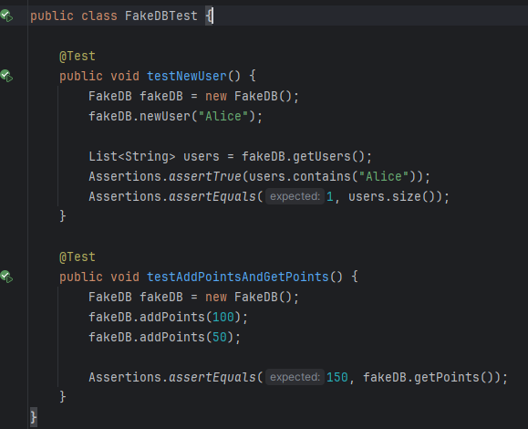
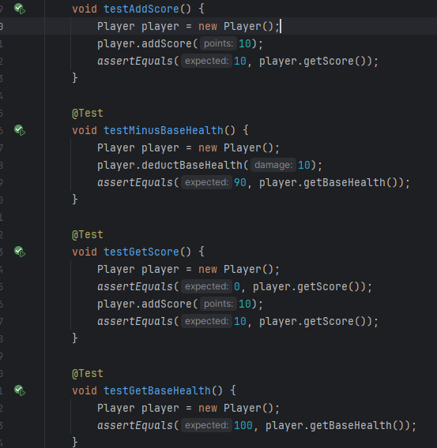

# Explicación del juego

Necesitamos diseñar un juego de tower defense para esto, necesitamos una base, enemigos, torres y puntos de vida.

Para esto vamos a implementar pruebas usando mocks, stubs y fakes, posteriormente usaremos pruebas de mutación con el fin de mejorar nuestros tests con su explicación.

# Clases

Las clases del proyecto serán explicadas a continuación:

## Game

Primero en la clase GAME se pide ingresar un comando, una vez iniciada la wave empiezan a avanzar los Enemigos. Para cada torre si pueden atacar en su rango, le bajan vida al enemigo y cuando terminan de matarlo se asigna un puntaje

Atributos:
 - player: jugador actual
 - currentWave: oleada actual
 - waves: lista de oleadas
 - map: tablero actual
 - towers: lista de torres

 Métodos:

 - nextWave: iniciar la siguiente oleada, activada cuando se escribe el comando START_WAVE
 - instante: unidad de tiempo en nuestro programa
 - placeTower: método para color una torre en una posición

Bucle Principal

En el main existe:

- Inicialización de las celdas
- Se solicita un comando
- Se divide el comando para la orden( poner torre o empezar oleada)
- Si es poner torre, se coloca un tipo de torre según la segunda frase del resto del comando
- Si es START_WAVE inicia la oleada

cada instante repite el mismo bucle que consiste en:

- Crear un array de enemigos para la wave actual
- Iterar en el array de enemigos y moverlos mientras estén vivos
- Evaluar si luego del movimiento de los enemigos sigamos con vida
- Iterar en todas las torres y atacar a cada enemigo y actualizar el estado de las torres
- Finalmente para cada enemigo del array verificar su existencia y que no hayan entrado a la base para otorgar los puntos al usuario

## Enemy 

La clase abstracta enemy sirve para poder inicializar extenderla a otros tipos de enemigos basico, rápido y jefe

Sus atributos son:

- speed: velocidad del enemigo
- health : vida del enemigo
- reward: puntos del enemigo conseguidos si se muere
- x , y : posición en el mapa

Sus métodos son:

- getters , setters 

Existen varias subclases para los diferentes tipos de enemy 

## Tower 

Esta clase abstracta sirve para poder extenderse a los demás tipos de torre cañon, laser y flecha. 

Sus atributos son:

- damage: daño de la torre
- range: alcance de golpe de la torre
- firerate: cantidad de disparos por ronda
- cooldown: tiempo de espera para disparar
- x,y : posición de la torre

Sus métodos son:

-  getters , setters 

existen subclases tambien con sus respectivas modificaciones para laser, cañon, arrow 

## Wave 

La clase wave define como se crearán los enemigos cada ronda, cuantos enemigos y que tipo de enemigos

Sus atributos son:

- enemies: esta lista de objetos tipo enemy, almacena todos los enemigos por cada oleada
- waveNumber: indica la cantidad de enemigos de una ronda

Sus métodos son:

- GenerateEnemies: Este método tiene un bucle for que define la cantidad de enemigos segun la waveNumber, si es múltiplo de 5 se crea un jefe, finalmente retorna la lista enemies
- Además getters , setters 

## Player 

Esta clase resulta útil para manejar el puntaje del jugador y como pierde puntos si un enemigo llega a la base

Sus atributos son:

- score: puntaje actual del jugador, puede aumentar al matar enemigos
- baseHealth: la vida de la base es decir del jugador, si los puntos llegan a 0 perdemos

Sus métodos son: 

- addScore: este método sirve para aumentar el puntaje al matar un enemigo
- deductBaseHealth: este método sirve para quitarnos puntos de vida si un enemigo llega a la base

- Además getters , setters 

# Implementación de pruebas

## Implementación de mockito 

Para utilizar mockito necesitamos agregar la dependencia en nuestro build.gradle, con esto nos aseguramos de poder utilizar mocks,stubs y fakes en nuestro proyecto

*testImplementation 'org.mockito:mockito-core:4.2.0'*

### Mocks:

• Utiliza Mockito para crear mocks de las clases Enemy y Tower para verificar la interacción
entre objetos.

Los mocks sirven para simular objetos y métodos reales, podemos aislarlos de dependencias externas y poder realizar pruebas sin necesidad de tener el escenario real.

En este caso podemos simular un arreglo de enemigos y simular el ataque de una torre.

Usamos un setUp con los diversos mocks, en este caso 2 mocks de enemy y un mock para la torre, luego definimos los comportamientos de cada mock. Finalmente verificar la interacción correcta entre los mocks

### Stubs:

• Crea stubs para métodos que devuelven enemigos o torres específicos.

Para retornar torres en especifico se debe agregar un getter para las torres

Nuestro stub sobreescribe el método para que el método getTowers retorne una lista de objetos en específico. En este caso cañon, laser y arrow.

Luego creamos el objeto towers y obtenemos la lista del método del stub. 

Usamos assert para comparar los resultados obtenidos.

- Cantidad de objetos en el arreglo
- Validad las clases de cada posición en el arreglo

### Fakes:

• Utilizar fakes para simular la base de datos de puntuación o estados de oleadas.

Podemos crear una base fake para el registro de usuarios y puntos. Con un array de usuarios y un atributo de puntos.

Con métodos para añadir nuevos usuarios, añadir puntos y sus respectivos getters

Creamos tests para nuestra nueva clase

1. Primer test creamos un nuevo usuario, luego con la ayuda de assert verificamos que el array de usuarios contenga al usuario recién creado y de tamaño de array 1

2. El segundo test, prueba añadir puntos a la base de datos y luego corroborar que sean los mismos puntos añadidos

Pruebas de mutación:

• Implementa pruebas de mutación para verificar la calidad de las pruebas unitarias.
• ¿Qué herramienta utilizarías para realizar pruebas de mutación en este proyecto, y cómo la
configurarías?

Añadimos pitest en nuestro proyecto 

• Configura la herramienta de pruebas de mutación para el proyecto y ejecuta un análisis de
mutación en la clase TowerDefenseGame.

## Evaluación de cobertura de pruebas:
• ¿Cómo interpretarías los resultados de las pruebas de mutación y qué acciones tomarías
para mejorar la cobertura de las pruebas?

El resultado de nuestro test de mutación es de 2% esto se debe a que al usar mocks y stubs. Las pruebas simulan el comportamiento de nuestras clases pero no como funcionan por dentro, sin analizar las lineas internas de código , ya que solo estamos modificando las salidas esperadas.

• Implementa mejoras en las pruebas unitarias basándote en los resultados de las pruebas de
mutación y explica las razones de cada cambio.

Añadimos los test para el resto de clases
### enemyTest
El primer test verifica que los enemigos reciben daño por la torre

El segundo test , verifica si inicializado el objeto se detecta como vivo y si al recibir suficiente daño muere.

El tercer test,verifica los movimientos de los enemigos y como se detectan en el mapa

### MapTest

En estos tests se busca diferenciar las diferentes ubicaciones dentro de la grilla. Como diferenciar entre un camino y la base

### PlayerTest

Estos tests buscan validar los diferentes instantes de la vida del jugador

### TowerTest
Podemos utilizar mocks y stubs para crear una tower creando setPosition e implementar el faltante upgrade y probarlo en testAttack

### WaveTest
De igual forma se usa un stub para el método generateEnemies para simular el retorno de la lista de enemigos, finalmente probamos la validez del stub en el test

Luego de los tests, mejora la cobertura de mutación

Puntaje completo: 10 puntos
# Preguntas de diseño e implementación (5 puntos)
Diseño de la clase Map:

• ¿Cómo implementarías la clase Map para representar el mapa del juego, asegurando que se
puedan agregar y verificar posiciones de torres y caminos?

Se puede crear métodos para validar cada celda del tablero verificando si son parte del camino, torre o base. Finalmente existe un método para colocar cualquier caracter en alguna celda 

Existe isPath, isBase, isTower para verificar la celda donde estamos.

• Implementa un método en la clase Map llamado isValidPosition(int x, int y) que verifique si
una posición es válida para colocar una torre.

Verifica si está libre y en el rango del tablero

Enemigos con diferentes características:

• Diseña e implementa una clase SpeedyEnemy que herede de Enemy y tenga una velocidad
mayor pero menos vida.

• ¿Cómo gestionarías el movimiento de los enemigos en el mapa, asegurando que sigan el
camino predefinido?

Podría buscar las celdas adyacentes y si encuentra alguna con el caracter 'C' en alguna de las 4 direcciones se mueve, además que se tiene que validar que no sea la base hacia donde se está moviendo

## Clase Enemy 

Primero validamos si en cualquiera de las 4 direcciones que se mueva el enemigo no sea base, sino se descuenta de la vida de la base y muere el enemigo. En caso que no sea base, se trata de mover a cualquiera de las 4 direcciones posibles

Torres con diferentes habilidades:

• Implementa una clase SniperTower que tenga un daño alto y un alcance muy largo pero una
velocidad de disparo baja.

• ¿Cómo implementarías el método attack(List<Enemy> enemies) en la clase Tower para
atacar a los enemigos dentro de su alcance?

Primero cada torre tiene una cadencia de disparo entonces se tiene que esperar un tiempo, luego si se puede atacar es decir, la cadencia o el tiempo de espera ya acabó ataca. Un cálculo de distancia euclidiana y si la distancia es menor al rango ataca

Sistema de oleadas:

• ¿Cómo diseñarías la generación de oleadas para que cada oleada sea progresivamente más
difícil?

Aparte de crearse un boss cada 5 rondas se puede guiar según la cantidad de torres en el campo 

• Implementa un método en la clase Wave llamado spawnEnemies() que genere los enemigos
de la oleada y los coloque en el mapa.

Sistema de puntuación y salud de la base:

• ¿Cómo actualizarías la puntuación del jugador y la salud de la base cuando un enemigo es
derrotado o alcanza la base?

Primero cuando un enemigo se quiere mover y es hacia la base el enemigo muere instantaneamente quitandole 10 puntos de vida al jugador y muriendo el enemigo. 

Y en mi bucle de instantes se verifica si no quedan más enemigos se otorgan los puntos_vida de los enemigos muertos

• Implementa un método en la clase Player llamado updateScoreAndHealth(Enemy enemy,
boolean defeated).

Pruebas estructurales (3 puntos)

Las pruebas estructurales se centran en verificar que el código cumpla con su estructura esperada y
que todas las ramas, condiciones y caminos estén correctamente cubiertos.

Cobertura de ramas:

• Ejercicio: Implementa pruebas para garantizar que todas las ramas del método placeTower
en la clase TowerDefenseGame estén cubiertas.

Cobertura de condiciones:

• Ejercicio: Escribe pruebas unitarias para verificar todas las condiciones en el método attack
de la clase Tower.

Cobertura de rutas:

• Ejercicio: Implementa pruebas para cubrir todos los caminos posibles en el método
startWave de la clase TowerDefenseGame.

Preguntas de pruebas con Mockito (2 puntos)

Mocking de dependencias:

• ¿Cómo usarías Mockito para crear un mock del Map y probar la colocación de torres en la
clase TowerDefenseGame?

• Implementa un test con Mockito para verificar que el método placeTower solo permite
colocar torres en posiciones válidas del mapa.

Stubbing de métodos:

• ¿Cómo usarías stubs en Mockito para simular el comportamiento del método getEnemies en
la clase Wave durante las pruebas?

• Implementa un test que use un stub para verificar el comportamiento del método startWave
en la clase TowerDefenseGame.